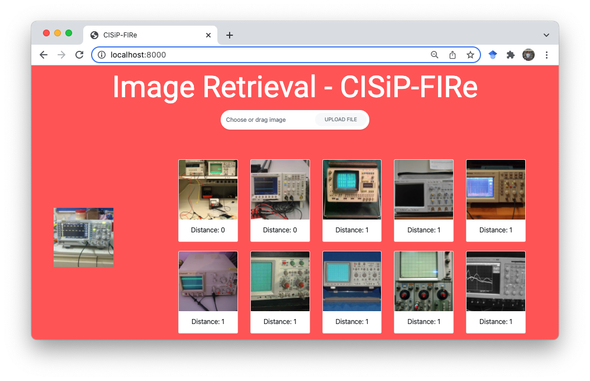

# Train a model
To train a model, the config(`--config`), dataset(`--ds`), and other parameters(see the usage below) has to be specified, or otherwise the default value will be used. We have included config file for most supported model in `configs/templates`.
```
usage: train.py [-h] [--config CONFIG] [--backbone BACKBONE]
                [--ds {imagenet100,nuswide,cifar10,imagenet50a,imagenet50b,cars,cifar10_II,landmark,landmark200,landmark500,gldv2delgembed,roxford5kdelgembed,descriptor,sop,sop_instance,food101,nuswide,coco,mirflickr}]
                [--dfolder DFOLDER] [--c10-ep {1,2}] [--ds-reset] [--usedb] [--train-ratio TRAIN_RATIO] [--nbit NBIT] [--bs BS] [--maxbs MAXBS] [--epochs EPOCHS]
                [--arch ARCH] [--gpu-transform] [--gpu-mean-transform] [--no-aug] [--resize-size RESIZE_SIZE] [--crop-size CROP_SIZE] [--R R]
                [--distance-func {hamming,cosine,euclidean}] [--zero-mean-eval] [--num-worker NUM_WORKER] [--rand-aug]
                [--loss {greedyhash,jmlh,dpn,orthocos,ce,bihalf-supervised,orthoarc,sdhc,csq,adsh,hashnet,dbdh,dpsh,mihash,sdh,dfh,dtsh,greedyhash-unsupervised,bihalf,ssdh,tbh,itq,pca,lsh,sh,imh,cibhash}]
                [--tag TAG] [--seed SEED] [--optim {sgd,adam,rmsprop,adan}] [--loss-params LOSS_PARAMS] [--device DEVICE] [--eval EVAL] [--lr LR] [--wd WD]
                [--step-size STEP_SIZE] [--lr-decay-rate LR_DECAY_RATE] [--scheduler SCHEDULER] [--backbone-lr-scale BACKBONE_LR_SCALE] [--resume]
                [--resume-dir RESUME_DIR] [--enable-checkpoint] [--save-model] [--save-best-model-only] [--discard-hash-outputs] [--load-from LOAD_FROM]
                [--benchmark] [--disable-tqdm] [--hash-bias] [--shuffle-database] [--workers WORKERS] [--train-skip-preprocess] [--db-skip-preprocess]
                [--test-skip-preprocess] [--dataset-name-suffix DATASET_NAME_SUFFIX] [--accimage] [--pin-memory] [--wandb]

optional arguments:
  -h, --help            show this help message and exit
  --config CONFIG       configuration file *.yml
  --backbone BACKBONE   the backbone feature extractor
  --ds {imagenet100,nuswide,cifar10,imagenet50a,imagenet50b,cars,cifar10_II,landmark,landmark200,landmark500,gldv2delgembed,roxford5kdelgembed,descriptor,sop,sop_instance,food101,nuswide,coco,mirflickr}
                        dataset
  --dfolder DFOLDER     data folder
  --c10-ep {1,2}        cifar10 evaluation protocol
  --ds-reset            whether to reset cifar10 txt
  --usedb               make all database images as training data
  --train-ratio TRAIN_RATIO
                        training ratio (useful when usedb is activated)
  --nbit NBIT           number of bits for hash codes
  --bs BS               batch size
  --maxbs MAXBS         maximum batch size for testing, by default it is max(bs * 4, maxbs)
  --epochs EPOCHS       training epochs
  --arch ARCH           architecture for the hash function
  --gpu-transform
  --gpu-mean-transform
  --no-aug              whether to skip augmentation
  --resize-size RESIZE_SIZE
                        Image Resize size before crop
  --crop-size CROP_SIZE
                        Image Crop size. Final image size.
  --R R                 if 0, using default R for specific dataset; -1 for mAP@All
  --distance-func {hamming,cosine,euclidean}
  --zero-mean-eval
  --num-worker NUM_WORKER
                        number of worker for dataloader
  --rand-aug            use random augmentation
  --loss {greedyhash,jmlh,dpn,orthocos,ce,bihalf-supervised,orthoarc,sdhc,csq,adsh,hashnet,dbdh,dpsh,mihash,sdh,dfh,dtsh,greedyhash-unsupervised,bihalf,ssdh,tbh,itq,pca,lsh,sh,imh,cibhash}
  --tag TAG
  --seed SEED
  --optim {sgd,adam,rmsprop,adan}
  --loss-params LOSS_PARAMS
  --device DEVICE       torch.device('?') cpu, cuda:x
  --eval EVAL           total evaluations throughout the training
  --lr LR               learning rate
  --wd WD               weight decay
  --step-size STEP_SIZE
                        relative step size (0~1)
  --lr-decay-rate LR_DECAY_RATE
                        decay rate for lr
  --scheduler SCHEDULER
                        LR Scheduler
  --backbone-lr-scale BACKBONE_LR_SCALE
                        Scale the learning rate of CNN backbone
  --resume
  --resume-dir RESUME_DIR
                        resume dir
  --enable-checkpoint
  --save-model
  --save-best-model-only
  --discard-hash-outputs
  --load-from LOAD_FROM
                        whether to load from a model
  --benchmark           Benchmark mode, determinitic, and no loss
  --disable-tqdm        disable tqdm for less verbose stderr
  --hash-bias           add bias to hash_fc
  --shuffle-database    shuffle database during mAP evaluation
  --workers WORKERS     number of workers
  --train-skip-preprocess
  --db-skip-preprocess
  --test-skip-preprocess
  --dataset-name-suffix DATASET_NAME_SUFFIX
  --accimage            use accimage as backend
  --pin-memory          pin memory
  --wandb               enable wandb logging

```
## Use the config file
You can create a new config file from the provided template. To specify argument(s), you may add `argument_key: argument_value` in the yaml config file. For loss parameters, you may add under the `loss_param` list. For example:
```yaml
loss: orthocos
loss_param:
  loss_param1: value
  loss_param2: value
new_argument: new_argument_value
```
```{warning}
Missing of loss params will cause error.
```
To start the training, you may run the training script at `train.py` with specify the config file and any additional arguments or otherwise the default value will be used. Do note that, the argument specify on the command line will override the value in config file.
```bash
python train.py --config configs/templates/orthocos.yaml --ds cifar10 --nbit 64 --epoch 100
```
```{note}
The priority of arguments is as follow: cli arguments > config file > default value.
```
Differ from the typical argument, to override the loss parameters, one must specify the argument `--loss-param` with their specific value seperated by colon and semicolon `"key1:value1;key2:value2"` to override the loss parameters(usually the hyper-parameters). For example:
```
--loss-param "m:0.4;s:8.0;cent_init:B"
```
```{note}
Some dataloader problem might occur when `--num-worker` is not set to 0 in Windows and macOS BigSur.
```
When the training task is launched, a log directory will be created. All the trained model(if`--save-model` specified), training loss, database and query codes, checkpoints(if enabled), etc will be stored in this directory. The directory will be created under `logs` directory with `<loss>_<backbone>_<arch>_<nbit>_<ds>_<epoch>_<lr>_<optim>/<order>_<tag>_<seed>` format, for example: 
```yaml
"logs/orthocos_alexnet_orthohash_64_cifar10_100_0.0001_adam/002_test_19084"
```
# Test a Model
Will be introduced soon.
# Inference trained model
We provide simple Web Interface for Inference that can be a good showcase or demo for trained model. 
This interface allows making simple inference on trained image retrieval model. 
By uploading a query image, it will return top k the nearest image from the database index.
This web interface is created with Flask framework and is very easy to use.

To start with this inference
1. Run the following command on the root of project:
    ```shell
    python inference.py --dir logs/orthocos_alexnet_orthohash_128_imagenet100_100_0.0001_adam/002_test_0 --device cuda:0 --k 10 --ip 0.0.0.0 --port 8000
    ```
   Note that `--dir` is required field, `--device`, `--k`, `--ip` and `--port` is optional.
    ```{note}
    First run will be slow, this is because we had to create index for all images in database, and is recommend to run with GPU. A decent GPU took less than 10 minutes. After that, the index will be stored in the log directory for future use.
    ```
2. Head to `http://<your ip address>:<port>`. By default, it is at http://localhost:8000/
3. Drag an image to the white box area and click on `Upload File`.
4. Here you go.
   
   

# Custom dataset
In `utils/datasets.py`, create a Dataset class for your custom dataset. Make sure return `image, class_id, and index_id` for each item.
```python
from torch.utils.data.dataset import Dataset


class ImageDataset(Dataset):
    def __init__(self, ...):
        self.data = ..
        pass
    def __getitem__(self, index):
        return image, class_id, index
    def __len__(self):
        return len(data)
```
In the same file, create a dataset-specific method for your custom dataset. For example:
```python
def new_dataset(**kwargs):
    transform = kwargs['transform']
    filename = kwargs['filename']
    suffix = kwargs.get('dataset_name_suffix', '')

    d = ImageDataset(f'data/imagenet{suffix}', transform=transform, filename=filename, ratio=kwargs.get('ratio', 1))
    return d
```
In `configs.py:289`, specify your dataset name and link it to the dataset method you have created, for example:
```python
datafunc = {
    'imagenet100': datasets.imagenet100,
    .
    .
    'new_dataset': datasets.new_dataset  # new dataset
}[dataset_name]
```
In the same `configs.py` file, at line `configs.py:53` specify the image size to resize. For example:
```python
r = {
    'imagenet100': 256,
    .
    .
    'new_dataset': 512 # new dataset resize size
}
```
At line `configs.py:80`, specify the crop size. For example:
```python
r = {
    'imagenet100': 224,
    .
    .
    'new_dataset': 486 # new dataset crop size
}
```
```{note}
The image is first resize then only crop. However, it could depends on how you specify the augmentation for your dataset, which will be introduct later in this section.
```
At line `configs.py:108`, specify the number of class for your dataset. For example:
```python
r = {
    'imagenet100': 100,
    .
    .
    'new_dataset': 10 # new dataset number of class
}
```
At line `configs.py:129`, specify the default number of image to retrieve per query (R). For example:
```python
r = {
    'imagenet100': 100,
    .
    .
    'new_dataset': 10 # new dataset default R
}
```
At line `configs.py:281`, add the dataset name to the conditon as follow:
```python
if dataset_name in ['imagenet100', 'nuswide', 'new_dataset']:
```
In `constants.py:datasets`, add the dataset name, for example:
```python
datasets = {
    'class': ['imagenet100', 'new_dataset'],
    'multiclass': ['nuswide'],
}
```
Lastly, in the another file at line `utils/augmentations.py:19`, in the method `get_train_transform`, specify the augmentation. For example:
```python
'nuswide': [
    transforms.Resize(resize),
    transforms.RandomCrop(crop),
    transforms.RandomHorizontalFlip()
],
'new_dataset': [
    transforms.RandomResizedCrop(crop),
    transforms.RandomHorizontalFlip()
],
```
# Custom data pipeline/ training method
Will be introduced soon.
# Custom backbone network
In this framework, we have implemented 3 popular backbone network, which are AlexNet, VGG, and ResNet. We also leave the option to add other backbone network.
This tutorial will give an example to implement a custom backbone network.

First, create a new python file `models/backbone/new_backbone.py`. Inside, create a new Backbone network extending the base class `BaseBackbone`. For example,
```python
class NewAlexNetBackbone(BaseBackbone):
    def __init__(self, nbit, nclass, pretrained=False, freeze_weight=False, **kwargs):
        super(NewAlexNetBackbone, self).__init__()

        model = alexnet(pretrained=pretrained)
        self.features = model.features
        self.avgpool = model.avgpool
        fc = []
        for i in range(6):
            fc.append(model.classifier[i])
        self.fc = nn.Sequential(*fc)
        self.classifier = model.classifier[-1]

        self.in_features = model.classifier[6].in_features
        self.nbit = nbit
        self.nclass = nclass

        if freeze_weight:
            for param in self.features.parameters():
                param.requires_grad_(False)
            for param in self.fc.parameters():
                param.requires_grad_(False)

    def get_features_params(self): # this is required method
        return list(self.features.parameters()) + list(self.fc.parameters()) + list(self.classifier.parameters())

    def get_hash_params(self): # this is required method
        raise NotImplementedError('no hash layer in backbone')

    def train(self, mode=True):
        super(NewAlexNetBackbone, self).train(mode)

        # all dropout set to eval
        for mod in self.modules():
            if isinstance(mod, nn.Dropout):
                mod.eval()

    def forward(self, x): # this is required method
        x = self.features(x)
        x = self.avgpool(x)
        x = torch.flatten(x, 1)
        x = self.fc(x)
        return x
```
Secondly, in `models.architectures.helper.get_backbone` add the definition(s) of your new custom backbone, for example:
```python
if backbone == 'alexnet':
    return AlexNetBackbone(nbit=nbit, nclass=nclass, pretrained=pretrained,
                           freeze_weight=freeze_weight, **kwargs)
if backbone == 'new_alexnet':
    return NewAlexNetBackbone(nbit=nbit, nclass=nclass, pretrained=pretrained,
                              freeze_weight=freeze_weight, **kwargs)

```
# Custom hashing architecture
New method might have a different architecture, our framework also allow custom architecture to be added. This tutorial will provide an example on how to add a new custom architecture.

Firstly, create a new python file at `models/architectures/arch_new.py`. Create a new architecture class extend the base class `BaseArch`. By extending this base class, the following attributes are accessible in the new architecture:
```python
self.backbone_name = config['arch_kwargs']['backbone']
self.nbit = config['arch_kwargs']['nbit']
self.nclass = config['arch_kwargs']['nclass']
self.pretrained = config['arch_kwargs'].get('pretrained', True)
self.freeze_weight = config['arch_kwargs'].get('freeze_weight', False)
self.bias = config['arch_kwargs'].get('bias', False)
self.config = config
self.hash_kwargs = config['loss_param']
```
The new class should created with annotation `@register_network('new_arch_name')` and extending the base class `BaseArch` like the example below:
```python
@register_network('dpn')
class ArchDPN(BaseArch):
    """Arch DPN, CSQ"""
    def __init__(self, config, **kwargs):
        super(ArchDPN, self).__init__(config, **kwargs)

        self.bias = config['arch_kwargs'].get('bias', False)

        self.backbone = get_backbone(backbone=self.backbone_name,
                                     nbit=self.nbit,
                                     nclass=self.nclass,
                                     pretrained=self.pretrained,
                                     freeze_weight=self.freeze_weight,
                                     **kwargs)
        self.ce_fc = nn.Linear(self.backbone.in_features, self.nclass)
        self.hash_fc = nn.Linear(self.backbone.in_features, self.nbit, bias=self.bias)

    def get_features_params(self): # this is a required method
        return self.backbone.get_features_params()

    def get_hash_params(self): # this is a required method
        return list(self.ce_fc.parameters()) + list(self.hash_fc.parameters())

    def forward(self, x): # this is a required method
        x = self.backbone(x)
        u = self.ce_fc(x)
        v = self.hash_fc(x)
        return u, v
```
`get_features_params()` should return the list of trainable parameter from backbone network, while `get_hash_params` should return the list of trainable parameters in the hashing layers. `forward` method should be defined with your computation graph following your architecture.

Then, you should add the created architecture in the whitelist at `supported_model` dict in `constants.py:47`, for example:
```python
supported_model = {
    'orthocos': ['orthohash', 'new_architecture'],
}
```
# Custom loss
First, create a new python file `functions/loss/new_loss.py`. Create the loss class like the example below:
```python
class NewLoss(nn.Module):
    def __init__(self, **kwargs):
        super(NewLoss, self).__init__()

        self.losses = {}  # required field

    def forward(self, x, h, b, labels, index, **kwargs):
        """
        x: features before hash layer
        h: output from hash FC
        b: binary code
        labels: not using (only use to obtain size)
        """
        
        loss1 = F.mse_loss(target_b, target_x)
        loss2 = ..
        loss = loss1+ loss2
        
        self.losses['mse'] = loss1  # to display and record the loss
        self.losses['loss2'] = loss2
        return loss
```
```{note}
The parameter for forward method will be different depends on type of the loss, the example above is for `unsupervised` method.
```
| Method type  | Loss params                                    |
|--------------|------------------------------------------------|
| supervised   | self, logits, code_logits, labels, onehot=True |
| unsupervised | self, x, h, b, labels, index, **kwargs         |
| pairwise     | self, u, y, ind=None                           |
| adversarial  | self, x, code_logits, rec_x, discs             |
| shallow      | self, x                                        |
| contrastive  | self, prob_i, prob_j, z_i, z_j                 |

The parameter could also differ from the default, but that will be out of the scope of this example.

Secondly, at `scripts.train_helper.get_loss`, in `loss` dict, add the new loss name and link it to the loss class. For example:
```python
loss = {
    'orthocos': OrthoCosLoss,
    'new_loss': NewLoss,
    ...
}
```
Then, at `losses` dict in `constants.py:28`, add the new loss name to the type of loss, for example, `new_loss` is a type of `supervised` loss/method:
```python
losses = {
    'supervised': ['orthocos', ...,  'new_loss'],
    ...
}
```
Lastly, add the created loss and their supported architecture in the whitelist at `supported_model` dict in `constants.py:47`, for example:
```python
supported_model = {
    'new_loss': ['orthohash', 'new_architecture'],
}
```

# W&B logging
To enable model logging using [Weight and Bias](https://wandb.ai/), it can be enabled by the command line argument 
`--wandb`. You should also login your account first by `wandb login` if you haven't.
Besides, you can also use `wandb init`.
```bash
python train.py ... --wandb
```